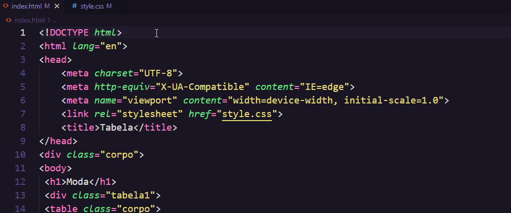

# Desafio 4 HTML e CSS básico 
Esse repositôrio foi criado para criar duas tabelas estilizadas. É somente um desafio criado pelo curso DevQuest, um curso em que eu faço parte, aprendi várias coisa nesse curso sobre programação 100% do que eu sei, foi atravéz desse curso.

## Como foi feito
Usei todo o conhecimento que eu sei sobre HTML e CSS.


### Também usei conhecimentos de HTML e CSS intermediário:


Que foi o 
```
margin:auto;
text-align: center
```
O objetivo foi feito para centralizar a tabela.


Esses códigos, eu aprendi vendo outros colegas falando sobre código e então tive a ideia de usar no projeto.